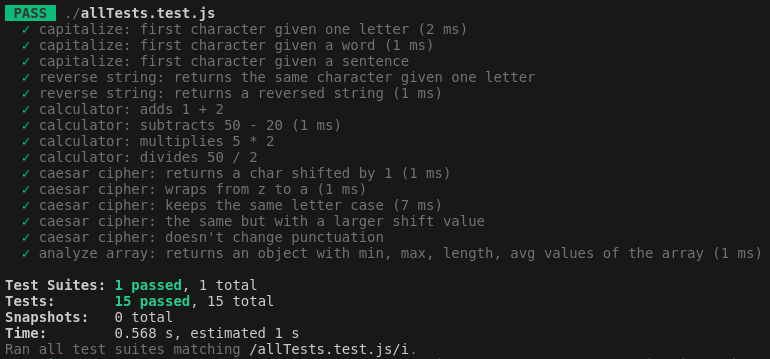

# Odin Project #16: Testing Practice

The goal of this Odin Project assignment was to practice testing using JavaScript and Jest.

I started and finished this project in March 2023.

## Assignment

[The Odin Project - JavaScript - #16 Testing Practice](https://www.theodinproject.com/lessons/node-path-javascript-testing-practice)

## Technology

- Vanilla JavaScript
- Jest

## Key Concepts

- Test Driven Development
- Jest
- Babel
- NPM
- ES6 Modules

## Functions

- capitalize: takes a string and returns it with the first character capitalized
- reverseString: takes a string and returns it reversed
- calculator: add, subtract, multiply, divide
- caesarCipher: takes a string and a shift factor and returns it with each character “shifted”
- analyzeArray: takes an array of numbers and returns an object with the following properties: average, min, max, and length

## Screenshots



## Deployment

```bash
# clone repo
git clone https://github.com/BrightNeon7631/odin-testing-practice.git

# install project dependencies
npm install --save-dev babel-jest @babel/core @babel/preset-env

# run tests
npm test allTests

```
